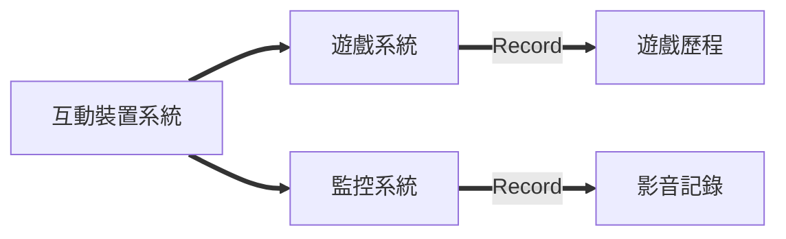

# Diagram Plugin

設定於本專案中的圖像插件(Diagram Plugin)，利用程式碼編輯樣式，將撰寫於內的程式碼來呼叫繪製邏輯產生圖檔

## [Mermaid](https://mermaidjs.github.io/)



## [Flowchart](http://flowchart.js.org/)

```flow
st=>start: 遊戲起始
e=>end: 遊戲結束
step1=>subroutine: 設定
step2=>subroutine: 劇情簡介
step3=>subroutine: 戰鬥設定
step4=>subroutine: 關卡說明
step5=>subroutine: 戰鬥場景
step6=>subroutine: 戰鬥結算

st(right)->step1->step2->step3->step4->step5(right)->e
```
